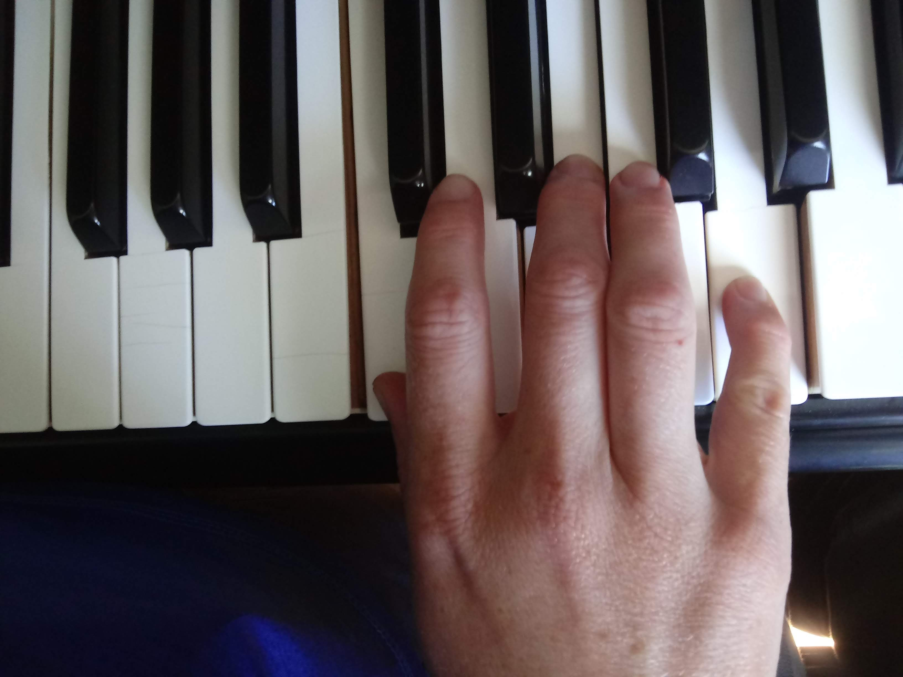
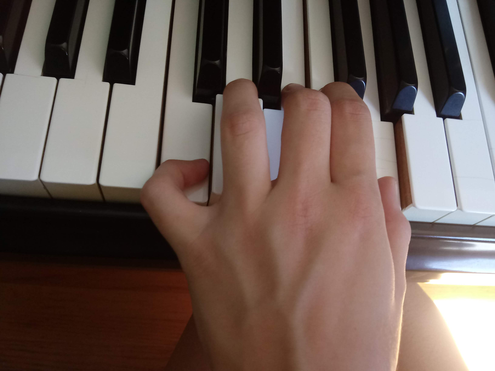
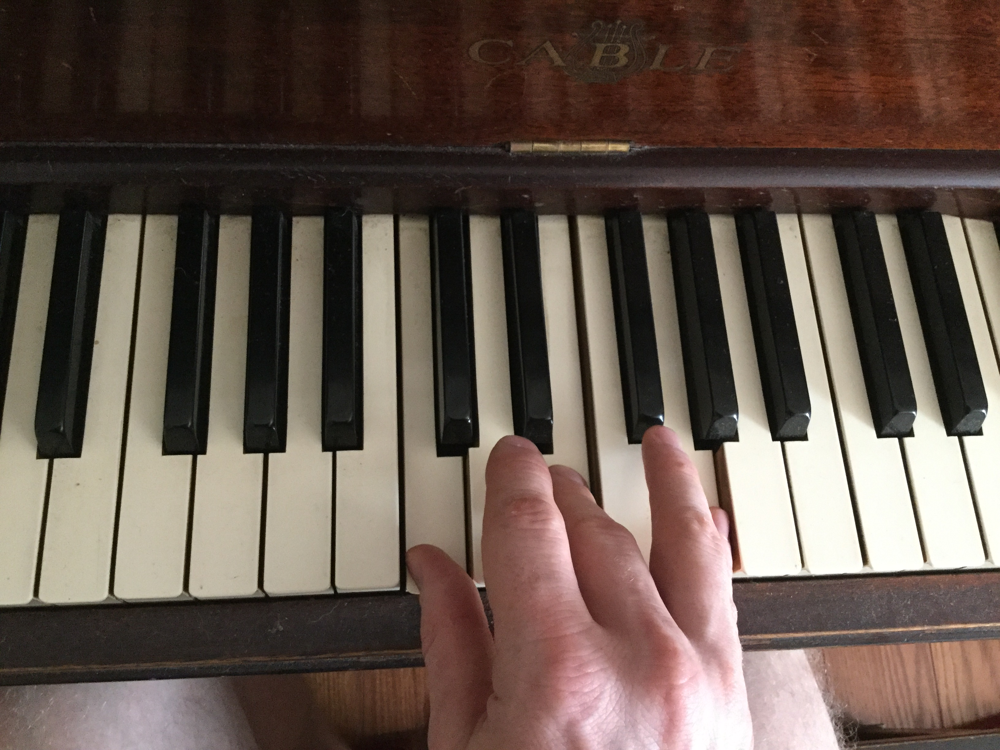
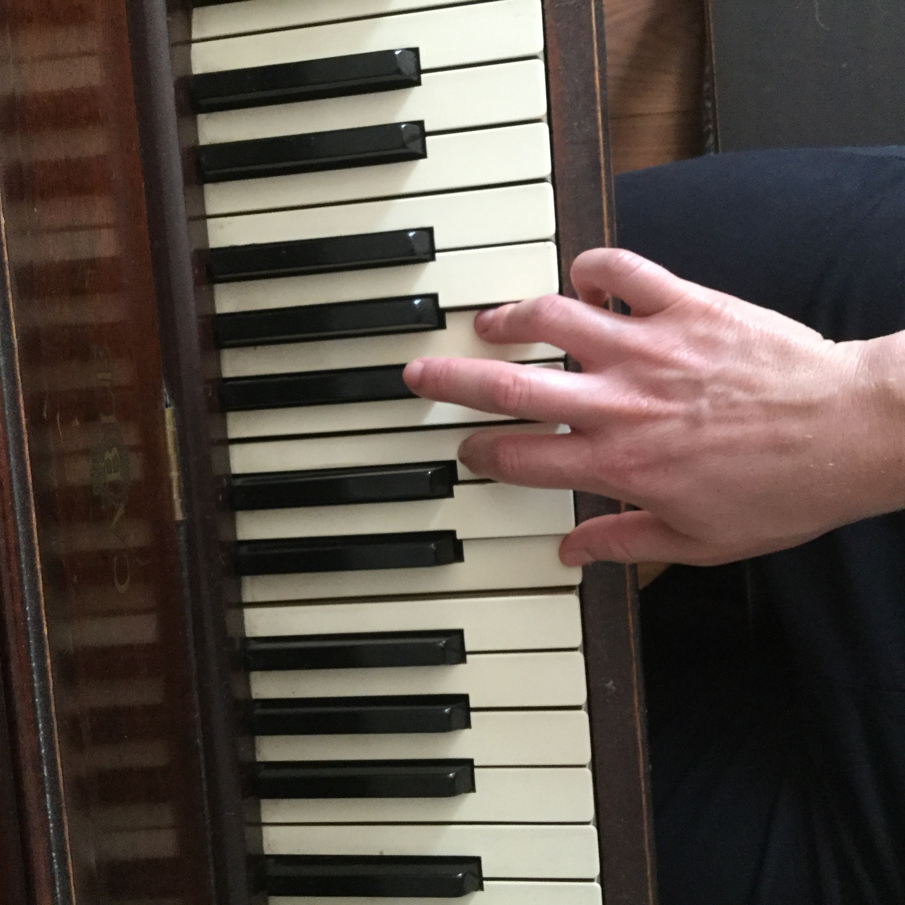
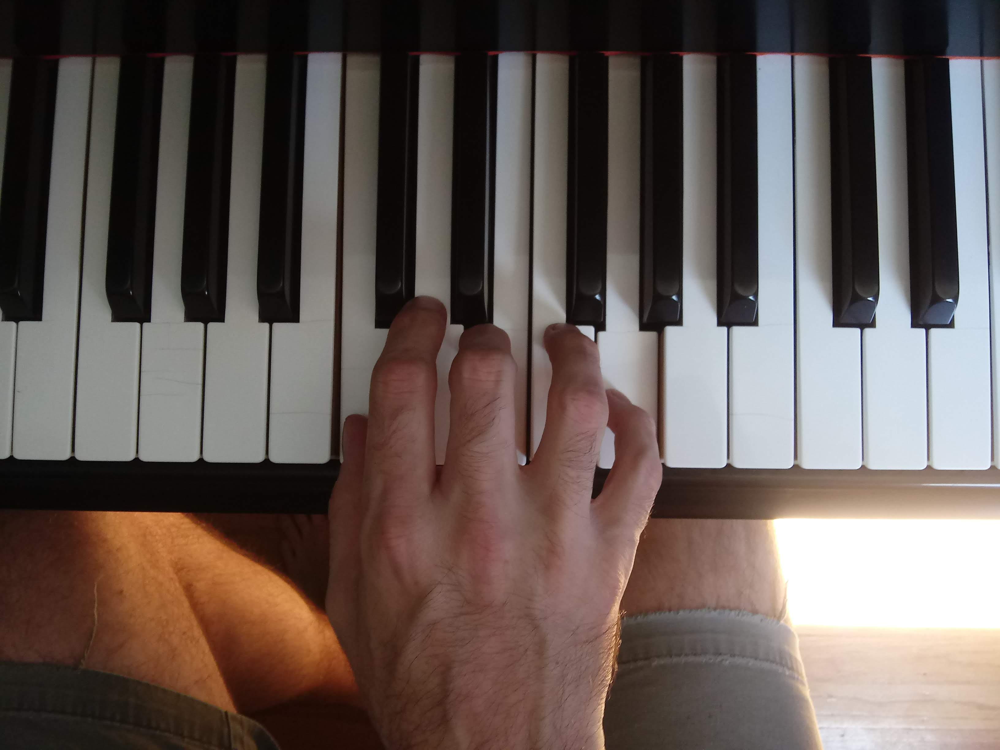

## A-CHORD-ing to the Image

#### Goal: 
Create an image classifier that can identify 3 chords on the piano. Images will be of a hand playing a chord on a piano. Chords played on left and right hand with different fingerings.

Stretch project: if I am successful with goal above, I'd like to be able to identify chords in real time.  It would be interesting if each chord could trigger a different sound (such as the sound of the chord) or a lighting change.

#### Background: 
While there are many chord identifiers based on audio input, I have not found many chord identifiers based on image.  I think this could have an impact during this time of virtual learning and could also aid deaf people learn to play the piano.  This would be a precursor to transcribing a song based on a video of someone playing.

#### Examples of the Images: 

    

    

    

    

    

