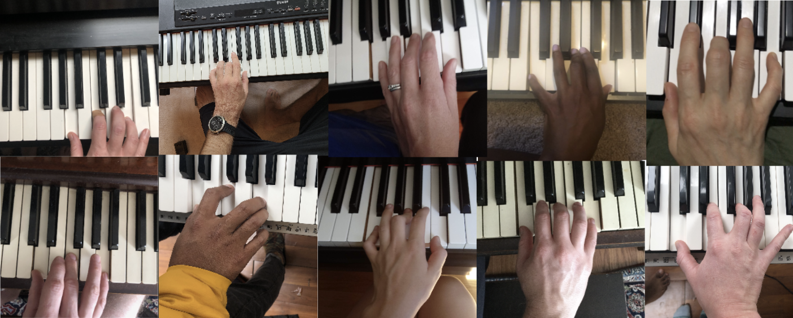
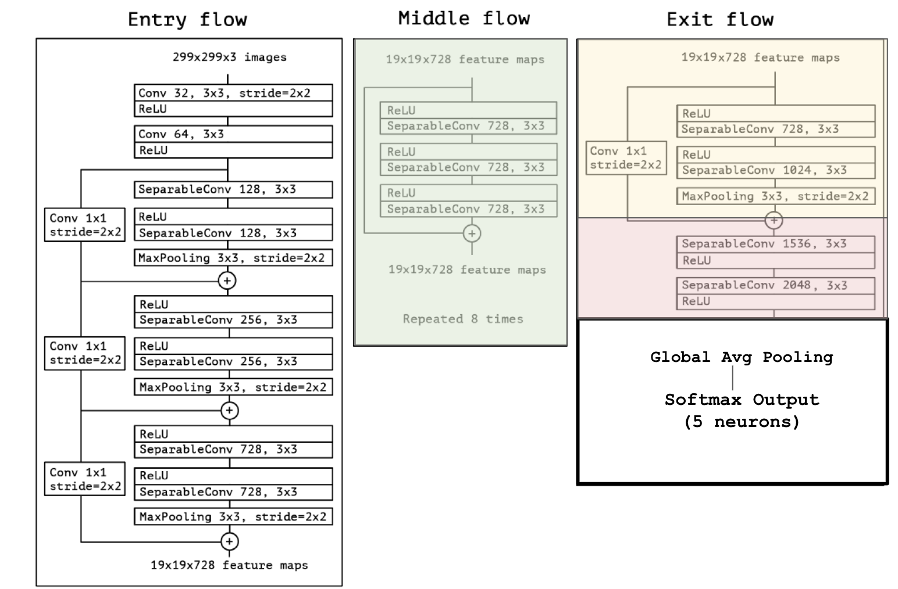
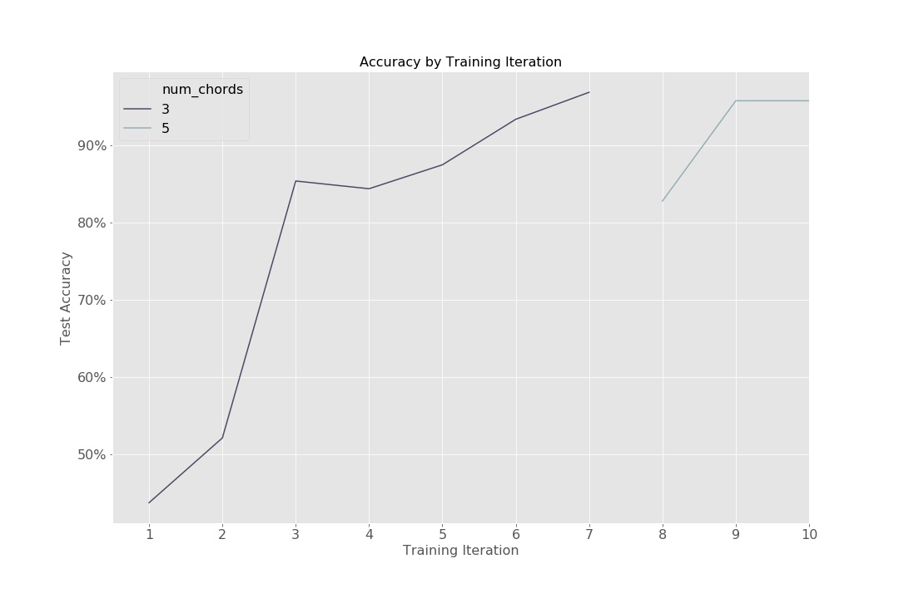
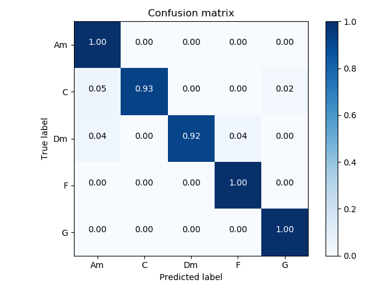

## A-CHORD-ing to the Image

#### Goal: 
The goal of this project is to create a piano chord classifier based on images.  

#### Background: 
Deep learning has been used to classify chords based on audio input, but there aren't many chord identifiers based on images. A chord image classifier could have many use cases such as helping hearing impaired musicians, supporting virtual learning, video transcription, and cuing theatrical changes for large productions. There is also an opportunity to build an ensemble model, combining the audio and image classifiers. 

#### Collecting the Data
With a "little help from my friends", I generated and self-labeled images of five chords: C, F, Am, Dm, and G.  The images came from 12 ppl and 8 unique pianos, included both left and right hands and multiple fingerings.  There were approximately XX images generated per person. 

I randomly split the raw images into training and validation sets, and then performed augmentation on the training set using the kera's ImageDataGenerator.  This created 20 additional images per raw training image, by randomly performing the following transformations: rotation, shearing, dilation, and translations.

### About the Model
I chose to use the Xception architecture, initialized to the ImageNet weights (add link to paper, keras.applications). This allowed me to leverage prior learning for a similar task, and accommodate my smaller sample size. The only changes made to the original architechture was the output layer, which was replaced by a 5-neuron softmax output.

The figure below shows the Xception architechture.  Colors indicate that the weights were adjusted from the original ImageNet weights. The tuning process is outlined in the section below.  The final model and associated weights is saved as model.hdf5 (don't forget to rename it to this lolz).

### Tuning Process
[should I mention how I went from 3 chords to 5 chords? ]

1. Outer layer tuned first 

[Here talk about process!! and fix the graph below

maybe a flow chart of what improvements made over time ]

#TODO: maybe just pick one metric to focus on?  make the graph less busy and they are all about the same 

### Model Performance

### Model Limitations